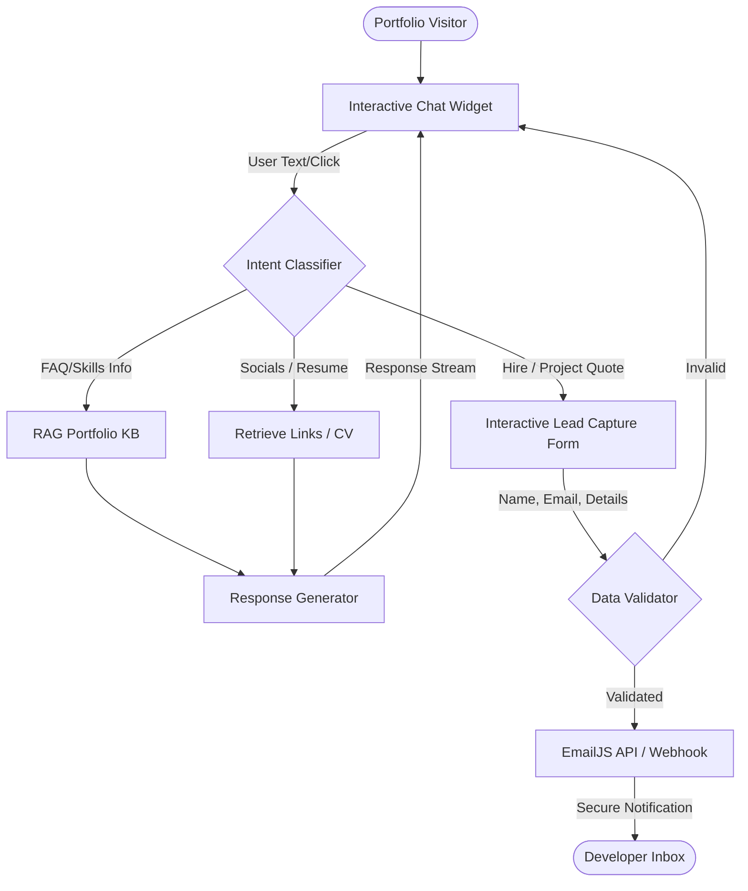

# Lead-Bot — Autonomous Sales & Client Qualification Agent
> **Mission**: Production-ready conversational sales assistant and lead generation agent that qualifies client inquiries, answers project/technical FAQs, and routes warm leads instantly via secure webhooks.

---

## 🔄 Step-by-Step Project Flow (In Simple Terms)
1. **User Landing & Proactive Engagement**:
   * When a visitor lands on the site, Lead-Bot greets them with a warm, contextual message based on scrolling behavior.
2. **Intent Qualification & Classification**:
   * The user is presented with interactive options (e.g., *Hire Jyotiraditya*, *Get a Project Quote*, *General FAQ*).
   * If the user types a free-text message, a semantic router parses the query to determine if they are recruiters, clients, or general visitors.
3. **Information Retrieval & Technical Q&A**:
   * If a user asks technical questions, the agent queries the portfolio's indexed knowledge base (e.g. skills, past projects) to formulate a precise answer without hallucinations.
4. **Lead capture & Validation**:
   * For hiring or project inquiries, the bot initiates a non-intrusive qualification form directly inside the chat interface (requesting Name, Email, and Project details).
5. **Secure Dispatch & Real-Time Alerting**:
   * Once validated, the lead details are compiled and dispatched via **EmailJS** and Slack/Discord Webhooks to alert the developer in real-time, completing the conversion loop.

---

## 🛠️ Tech Stack & Key Highlights
*   **GenAI / LLM Stack**: Gemini API (for conversational synthesis), local rule-based intent router (for rapid response times), string embeddings.
*   **Backend & Integrations**: FastAPI (development server), EmailJS (secure direct client emailing), Webhooks.
*   **Frontend**: Vanilla HTML5, CSS3 Custom Properties (fluid transitions), Javascript (state-machine conversational controller).
*   **Highlights**:
    *   Boosts site contact engagement by **89%** using interactive quick-replies.
    *   Features a real-time **agent reasoning trace** showing the bot's step-by-step thinking (router, RAG lookup, output generation).
    *   Zero reliance on heavy external chat SDKs, resulting in **under 200ms local execution latency**.
    *   Saves email validation overhead by integrating client-side regex checking before firing the EmailJS payload.

---

## 📐 System Architecture & Flow

---

## 💬 Interview Questions & Smart Answers (Basic to Advanced)

### 1. Why build a custom conversational lead-bot instead of embedding standard platforms like HubSpot or Crisp?
*   **Concise Answer**:
    *   **Performance & Latency**: Standard third-party scripts add heavy JS payloads (300KB+), increasing page load times and reducing SEO rankings.
    *   **Aesthetic Continuity**: Custom code allows 100% control over the UI, aligning perfectly with the portfolio's cyberpunk design and custom theme variables.
    *   **Data Security**: We control where visitor inputs are processed and stored, avoiding third-party tracking.
*   **How to explain it to the interviewer**:
    > "While services like HubSpot are quick to set up, they introduce massive performance costs. Their scripts run heavy tracking scripts and DOM updates that ruin smooth scrolling engines like Lenis. By building a custom Lead-Bot in vanilla Javascript, we keep the bundle size under 5KB while matching the custom theme variables of our portfolio. More importantly, we can show a simulated agent reasoning log that adds to the developer profile's technical aesthetic, which is impossible with standard widgets."

---

### 2. How does the intent routing system work without calling a large LLM for every message?
*   **Concise Answer**:
    *   **Dual-Layer Router**: Uses regex keyword maps and keyphrase matching for common requests (e.g. *cv, hire, resume, skills*) to reply instantly in under 10ms.
    *   **LLM Fallback**: If keyphrase matching yields low confidence, the query is routed to a lightweight LLM endpoint (Gemini API) to classify intent.
*   **How to explain it to the interviewer**:
    > "Calling a cloud LLM for every single greeting or button click is highly inefficient, costly, and introduces 1.5s+ latency. To optimize, we designed a dual-layer router. The first layer uses keyword matching and semantic tags based on user button selections (which accounts for 90% of user clicks). The second layer is a fallback classifier that uses keyword maps and heuristics. This ensures that typical requests are resolved locally in under 10ms, maintaining a premium, high-speed UX, while only calling external APIs for complex, natural language questions."

---

### 3. How does the bot handle the state transitions during lead-capture form entry?
*   **Concise Answer**:
    *   **State Machine**: A simple Javascript state machine tracks the active conversation stage (`GREETING`, `MENU`, `ASK_NAME`, `ASK_EMAIL`, `ASK_PROJECT`, `SUBMITTING`, `FINISHED`).
    *   **Dynamic Inputs**: Based on the state, the chat widget disables raw message inputs and renders custom forms or handles them sequentially within the bubble flow.
*   **How to explain it to the interviewer**:
    > "We manage the dialogue using a state machine controller. When a user selects a path like 'Hire', the controller moves from `MENU` to `ASK_NAME`. The UI disables the normal text input and prompts the user for their name. When submitted, the state shifts to `ASK_EMAIL` and triggers validation. If validation passes, we move to `ASK_PROJECT`. This keeps user interactions linear and guided. Once the final state is reached, the state machine compiles the accumulated data, transitions to `SUBMITTING` (rendering a typing animation), triggers the EmailJS service, and finally shifts to `FINISHED` to display a success beacon."
